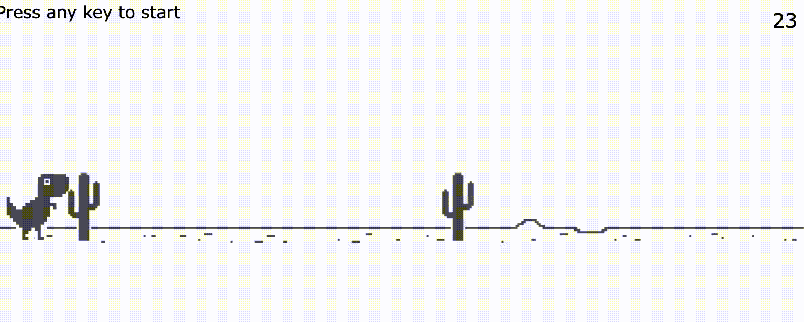

# README.md

This is a clone of the Google Chrome web browser dinosaur game.



To run locally, you will need Node.js installed on your system and the `live-server` package.

To install the package:

```
yarn global add live-server
```

To run the server:

```
npx live-server
```

The application will be running on `localhost:8080`.
